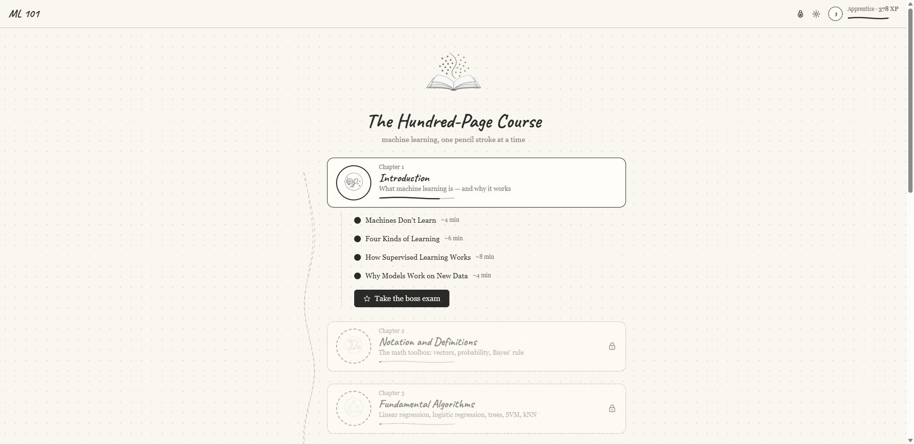

# ML 101 — The Hundred-Page Course

A gamified, fully interactive web course that teaches the material of Andriy Burkov's
*The Hundred-Page Machine Learning Book* — 11 chapters, 46 lessons, 21 hands-on
visualizations, checkpoint quizzes, boss exams, XP, badges, an adaptive placement
check, and a printable certificate. Everything runs in the browser; no backend, no
account. Progress is saved locally.

> **This is an unofficial study companion, not the book.** Every lesson here is our
> own paraphrase of ideas that Andriy Burkov explains properly and in full. The book
> itself is not redistributed in this repository — please get it from
> **[themlbook.com](https://themlbook.com/)**. This project is not affiliated with or
> endorsed by the author or publisher.
>
> The MIT license covers *this project's* code, lesson wording, exercises and
> illustrations only.



## Run it

```bash
npm install        # once
npm run dev        # → http://localhost:5173
```

## Build it

```bash
npm run build           # → dist/          for hosting (Vercel, Netlify, any static host)
npm run build:offline   # → dist-offline/  one self-contained index.html
```

The offline build produces a single `index.html` that works from a double-click
(`file://`) — routing, math rendering, widgets and saved progress all function with
no server and no network. Share that file freely.

The hosted build keeps JavaScript, CSS, fonts and images as separate content-hashed
files so browsers cache them between visits, which is what you want on a real deploy.

## What's inside

- **Lessons** for all 11 chapters, with proper maths typesetting and equations whose
  symbols you can tap to see what each one means in plain English.
- **21 interactive widgets** — drag an SVM decision boundary and watch its equation
  change with it, push gradient descent until it overshoots, grow a decision tree by
  information gain, train a small neural network on XOR and watch the boundary bend,
  run k-means and DBSCAN step by step, explore ROC curves, and more.
- **A game layer**: XP and levels, checkpoint quizzes with instant feedback, chapter
  boss exams with eraser lives, badges, a cumulative final exam, and a certificate.

## Starting where you belong

You do not have to begin at page one.

- **Placement check** (offered on the map to new learners, and always available in
  Settings): an adaptive check that binary-searches your level rather than marching
  through the book — it usually settles in **about six questions**. Everything up to
  the chapter you demonstrate is marked as known, worth 100 XP each.
- **Test out of a single chapter**: every chapter you haven't cleared has an
  *"Already know it? Test out"* button — 8 questions, one eraser. Pass and the chapter
  counts as read and the next one opens; fail and nothing is lost.

Skipped chapters are never hidden. The lessons, widgets and their XP stay there for
whenever you want to go back, and placement only ever adds progress — it cannot take
any away.

## Your progress

Every action — an answered question, a completed section, a widget challenge — is
saved the moment it happens. There is no save button, no account, and no data leaves
your machine: progress lives in your own browser, so if this is deployed publicly
every visitor simply keeps their own.

Settings → **Export** copies your progress out as text and **Import** restores it,
which is also how to carry progress between the dev server, a deployed copy, and the
offline file — each is a separate origin, so each keeps its own progress.

---

Based on the book by Andriy Burkov ("read first, buy later"). All lesson text is
original paraphrase; buy the book — it is excellent and genuinely a hundred pages.
